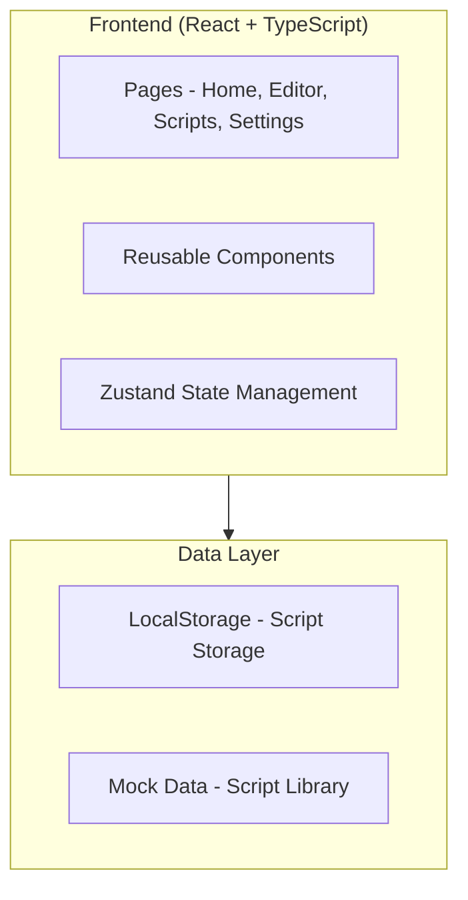
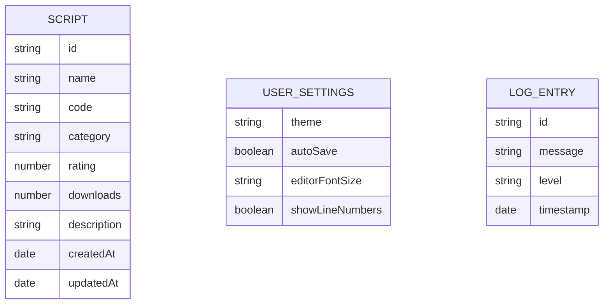

## 1. Architecture Design


## 2. Technology Description
- Frontend: React@18 + TypeScript + tailwindcss@3 + vite
- Initialization Tool: vite-init
- Backend: None (纯前端项目)
- Database: LocalStorage (本地存储)
- State Management: Zustand
- UI Components: Custom components with Tailwind CSS
- Code Editor: Monaco Editor (或自定义编辑器)

## 3. Route Definitions
| Route | Purpose |
|-------|---------|
| / | 首页 - 功能展示和导航 |
| /editor | 脚本编辑器 - 代码编辑和执行 |
| /scripts | 脚本库 - 浏览和管理脚本 |
| /settings | 设置中心 - 用户配置 |

## 4. API Definitions
本项目为纯前端项目，无后端 API。

## 5. Server Architecture Diagram
不适用，无后端服务。

## 6. Data Model

### 6.1 Data Model Definition


### 6.2 Data Definition Language
```typescript
// Script 类型定义
interface Script {
  id: string;
  name: string;
  code: string;
  category: string;
  rating: number;
  downloads: number;
  description: string;
  createdAt: Date;
  updatedAt: Date;
}

// 用户设置类型定义
interface UserSettings {
  theme: 'dark' | 'light';
  autoSave: boolean;
  editorFontSize: number;
  showLineNumbers: boolean;
}

// 日志条目类型定义
interface LogEntry {
  id: string;
  message: string;
  level: 'info' | 'success' | 'warning' | 'error';
  timestamp: Date;
}
```
