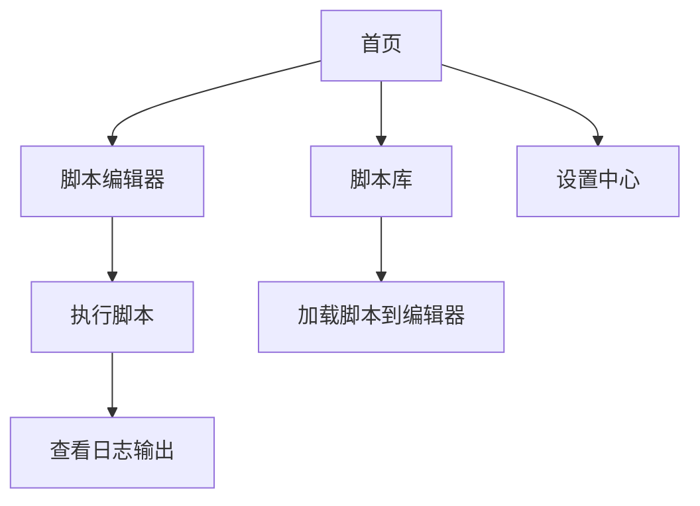

## 1. Product Overview
Kai Hub 是一个功能强大的 Roblox 脚本执行平台，提供安全、高效、易用的脚本管理和执行环境。
- 为 Roblox 玩家和开发者提供脚本存储、编辑、执行和分享功能
- 提供多种安全防护机制，确保账号安全

## 2. Core Features

### 2.1 User Roles
| Role | Registration Method | Core Permissions |
|------|---------------------|------------------|
| Normal User | 无需注册即可使用基础功能 | 脚本执行、脚本库浏览、基本编辑 |
| Pro User | 升级解锁 | 云端存储、高级功能、脚本分享 |

### 2.2 Feature Module
1. **首页**: Hero 展示区、导航菜单、核心功能介绍
2. **脚本编辑器**: Lua 代码编辑器、语法高亮、执行功能
3. **脚本库**: 精选脚本、分类浏览、搜索功能
4. **设置中心**: 用户设置、安全配置、快捷方式
5. **日志输出**: 实时日志、性能监控、错误追踪

### 2.3 Page Details
| Page Name | Module Name | Feature description |
|-----------|-------------|---------------------|
| 首页 | Hero 展示区 | 品牌展示、核心功能亮点、用户数据统计 |
| 首页 | 导航栏 | 响应式导航、用户头像、Pro 标识 |
| 脚本编辑器 | 代码编辑 | 语法高亮、自动补全、错误提示 |
| 脚本编辑器 | 执行控制 | 立即执行、保存、新建、更多功能 |
| 脚本库 | 脚本列表 | 精选推荐、热门脚本、评分展示、下载量 |
| 脚本库 | 分类筛选 | 精选推荐、最新上传、热门脚本、高评分脚本 |
| 日志输出 | 实时日志 | 时间戳、日志级别、彩色输出、日志管理 |
| 性能监控 | 系统信息 | CPU 使用率、内存使用、网络延迟、运行状态 |

## 3. Core Process
用户进入平台后，可通过导航菜单访问各个功能模块。主要流程包括：
1. 浏览脚本库选择脚本或在编辑器中编写代码
2. 在脚本编辑器中执行脚本
3. 查看实时日志输出和性能监控
4. 将常用脚本保存到云端存储

## 4. User Interface Design
### 4.1 Design Style
- 主色调：深紫色 (#6d28d9)、紫色 (#8b5cf6)、黑色背景
- 按钮风格：圆角矩形、渐变背景、悬停发光效果
- 字体：现代无衬线字体，标题粗体，正文清晰易读
- 布局风格：卡片式布局、玻璃态效果、动态粒子背景
- 图标风格：现代简约、线性图标、紫色主题

### 4.2 Page Design Overview
| Page Name | Module Name | UI Elements |
|-----------|-------------|-------------|
| 首页 | Hero 展示区 | 大标题、渐变文字、粒子背景、功能图标网格 |
| 首页 | 功能列表 | 玻璃态卡片、紫色渐变、图标+文字组合 |
| 脚本编辑器 | 编辑器区域 | 深色主题、代码高亮、行号显示、滚动条美化 |
| 脚本库 | 脚本卡片 | 缩略图、标题、评分、下载量、标签 |
| 日志输出 | 日志区域 | 黑色背景、彩色文本、时间戳、自动滚动 |

### 4.3 Responsiveness
- 桌面端优先设计，自适应各种屏幕尺寸
- 平板和移动端优化布局，确保良好的用户体验
- 触摸交互优化，按钮和可点击元素尺寸适中

### 4.4 3D Scene Guidance
本项目不涉及 3D 场景。
